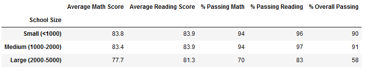
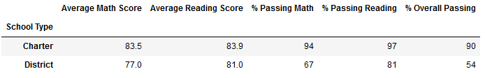

# Module 04 Challenge - School District Analysis

|FERPA (Family Educational Rights and Privacy Act of 1974) COMPLIANCE
|:-
|Student ID Numbers, Student Names, and Student Genders are currently present within the `students_complete.csv` file provided by the School Board. This information is not disclosed and is kept private in all of the summary statistics contained within this report. However, it should be noted that this source data is currently hosted on a publicly-accessible GitHub Repository for review. While not explicitly in violation of FERPA Regulations, secure-private hosting of this sensitive data should be considered moving forward. Alternatively, the data could be sufficiently anonymized prior to public hosting.|

## Project Overview
The School Board desired an analysis of School District data to help with budgeting and planning.

The desired results were:
#### District-Wide
- Total Schools in District
- Total Students in District
- Total Budget of District
- Average Math Score of District
- Average Reading Score of District
- % of Students Passing Math in District
- % of Students Passing Reading in District
- Overall % of Students Passing both Math and Reading in District

#### Per-School
- The Type of School (Charter or District)
- A Per-School Summary of all the same category results determined previously on a District-Wide basis
- Determine and list the Top 5 and Bottom 5 Performing Schools, based on % Overall Passing
- Determine Average Math and Reading Scores by School, by Grade Level

#### Additional Analysis
- Aggregate per-Capita Spending per Student by School, arrange into 4 spending ranges such that a roughly equal number of schools falls within a given spending range. Determine for each:
	- Average Math Score
	- Average Reading Score
	- % of Students Passing Math
	- % of Students Passing Reading
	- Overall % of Students Passing both Math and Reading
- Group Schools into Small, Medium, or Large based on whether their student count is <1000, between 1000-2000, or between 2000-5000. Determine for each:
	- Average Math Score
	- Average Reading Score
	- % of Students Passing Math
	- % of Students Passing Reading
	- Overall % of Students Passing both Math and Reading
- Group Schools by Type (Charter or District). Determine for each:
	- Average Math Score
	- Average Reading Score
	- % of Students Passing Math
	- % of Students Passing Reading
	- Overall % of Students Passing both Math and Reading

We were provided with two original source data files from the School Board, as shown below in [Resources](https://github.com/TPapiernik/Module_04_Challenge#resources). These two source data files contained information for each school and student within the district. This information was combined, cross-referenced, and summarized to produce the results discussed here in this report.

|DISCLAIMER
|:-
|At the outset, it should be noted that the School Board has identified that reading and math scores may have been altered for 9th Grade Students at Thomas High School. At this time, the School Board does not know the full extend or nature of the academic dishonesty.|

Therefore, the purpose of this analysis was threefold:
1. Calculate summary statistics outlined above.
2. Exclude all Thomas High School 9th Grade Reading and Math Scores. Re-run the analysis, and determine how these changes affected the results.
3. Provide commentary and insight for Items 1. and 2. above.

## Resources
- Data Source(s): `schools_complete.csv`, `students_complete.csv` (Provided by the School Board)
- Software: Jupyter notebook server 6.3.0, running Python 3.7.10 64 bit (Dependencies: pandas, numpy)

## Results

### Data Quality
Prior to beginning the main discussion of results, it should be noted that some of the Student Name records presented in the `students_complete.csv` corpus were found to contain inaccurate name Prefixes and Suffixes such as "Dr.", "DDS", and "Miss". It is not known exactly how or when these incorrect modifications made their way into the dataset, but it can guessed that it is due to some combination of clerical error and misdirected application of youthful exuberance.

Before starting the rest of the analysis, the Student Names in `students_complete.csv` were edited to remove the prefixes and suffixes Dr., Mr., Ms., Mrs., Miss, MD, DDS, DVM, and PhD. Other suffixes such as Jr., II, III, etc. were left in place. Overall, 1,402 student names were corrected in this manner. Should the School Board wish to receive a list of the names for upstream correction, it can be furnished upon request.

Besides the previously-mentioned qualifications, the dataset otherwise showed all signs of being uniform, rectangular, and consistent.

### Summary of Results and Discussion

[List of Figures](https://github.com/TPapiernik/Module_04_Challenge#list-of-figures) below.

As stated above in [Project Overview](https://github.com/TPapiernik/Module_04_Challenge#project-overview), the purpose of this analysis was threefold: 1. To calculate the summary statistics requested. 2. To exclude 9th Grade Math and Reading Scores from Thomas High School and determine how these changes affected the results, and 3. Discuss.

Firstly--at least from a mathematical standpoint--the inclusion or exclusion of the 9th Grade Thomas High School scores mattered very little to the overall results. When considering the Top 5 Schools based on % Overall Passing, the Average Math Score of Thomas High School remained the same, while the Average Reading Score changed to 83.9% from 83.8% (Figures 3 & 4). The implications of this result show that whatever sort of Academic Dishonesty took place with these scores, it is difficult to discern, at least by using the summary statistics available. It is plain to say that of course this is the intended outcome of cheating. If abnormally low or abnormally high scores were present among the student scores within this grade, it would be readily discovered using conventional statistical methods. At present, actual scores are unavailable for students within this grade at Thomas High School, therefore they were wholly excluded as can be seen in (Figures 8 & 10).

Moving forward, there are some overall conclusions that can be drawn from the rest of the analysis:

- District-wide, approximately 10% more students pass Reading than Math
- All of the Top 5 Schools are Charter Schools, and All of the Bottom 5 Schools are Conventional District Schools
- From a broad perspective, All Charter Schools have similar results with little variance between Average Scores among them, and similarly All District Schools have similar results with little variance between Average Scores among them.
- Within a given school, Average Scores for each subject are relatively constant between grade levels.
- Average Scores, particularly in Math, and % Overall Passing are Negatively Correlated with per-capita spending per student. It should be noted, however, that this is also directly tied to the differences in spending between Charter Schools and District Schools. There are certainly other reasons to account for these different outcomes, which should be explored more at length. (For reference purposes, the current average Budget Allocation for the Charter Schools in the District is: $912,688 per school, while for the District Schools it is: $2,478,275 per school.) 
	- For future discussion: Do District Schools have additional classroom and non-classroom costs that could be normalized to better account for the current apparent stark differences in academic outcomes? For example: additional purchases of books and materials, school bus transportation, school lunches, sports programs, additional staff, extra maintenance, security, etc.? Just at a glance, the average enrollment at the District Schools is 2.5 times the size of the average enrollment at the Charter Schools. It might not be fair to do an apples-to-apples comparison between them prior to normalizing for other factors.
- The results by School Size mirror the results by per-capita spending, and can likely largely be explained in the same manner as the Charter vs. District School comparison outlined in the previous bullet.

### Future Work and Recommendations

- Consider longitudinal observation and analysis of individual student scores, both as a way to track progress, and/or to aid in the discovery of academic dishonesty.
- Consider separate analysis and discussion of results among Charter Schools and District Schools.
	- Alternatively, perform more extensive normalization of budget figures prior to comparison.
	- Are Charter Schools really achieving More with Less?
- As the questions: What isn't working with Math Instruction that is working for Reading Instruction? and How are Charter Schools achieving overall better academic results, particularly in the field of Math?
- If feasible over the long-term, could reducing the total enrollment per school at the District Schools help with academic results? Could students be transferred to the Charter Schools to lessen the burden at the District Schools, or could new District Schools be built?

## List of Figures

### District-Wide Summary

Figure 1: District-Wide Summary (Pre-Correction)

Figure 2: District-Wide Summary (Post-Correction)

### Per-School Summary

#### Top 5 Schools

Figure 3: Top 5 Schools (Pre-Correction)

Figure 4: Top 5 Schools (Post-Correction)

#### Bottom 5 Schools

Figure 5: Bottom 5 Schools (Pre-Correction)

Figure 6: Bottom 5 Schools (Post-Correction)

#### Average Math and Reading Scores by School, by Grade Level

Figure 7: Average Math Scores by School, by Grade Level (Pre-Correction)

Figure 8: Average Math Scores by School, by Grade Level (Post-Correction)

Figure 9: Average Reading Scores by School, by Grade Level (Pre-Correction)

Figure 10: Average Reading Scores by School, by Grade Level (Post-Correction)

### Additional Analysis

#### Per-Capita Spending by School Summary

Figure 11: Summary of Results by Per-Capita Spending per Student (Pre-Correction)

Figure 12: Summary of Results by Per-Capita Spending per Student (Post-Correction)

#### School Size Summary

Figure 13: Summary of Results by School Size (Pre-Correction)

Figure 14: Summary of Results by School Size (Post-Correction)

#### School Type Summary

Figure 15: Summary of Results by School Type (Pre-Correction)

Figure 16: Summary of Results by School Type (Post-Correction)

